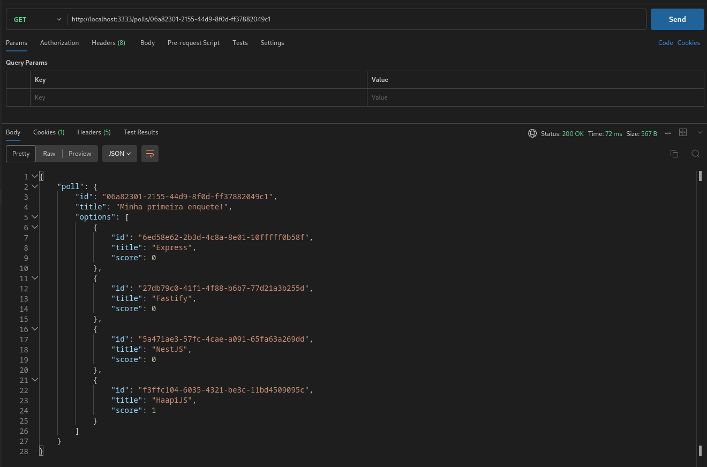

<div align="center" id="top">
  

  &#xa0;

</div>

<h1 align="center">NLW 14 Expert - Polls</h1>

<p align="center">
  

  

  

  

</p>

<hr>

<p align="center">
  <a href="#dart-sobre">Sobre</a> &#xa0; | &#xa0;
  <a href="#sparkles-funcionalidades">Funcionalidades</a> &#xa0; | &#xa0;
  <a href="#rocket-tecnologias">Tecnologias</a> &#xa0; | &#xa0;
  <a href="#white_check_mark-requisitos">Requisitos</a> &#xa0; | &#xa0;
  <a href="#checkered_flag-iniciando">Iniciando</a> &#xa0; | &#xa0;
  <a href="#memo-licença">Licença</a> &#xa0; | &#xa0;
  <a href="https://github.com/andrelinos" target="_blank">Autor</a>
</p>

<br>

## :dart: Sobre ##

Descrição do projeto

## :sparkles: Funcionalidades ##

:heavy_check_mark: Criar novas enquetes;\
:heavy_check_mark: Editar enquete;\
:heavy_check_mark: Deletar enquete;\
:heavy_check_mark: Votar em enquete;\
:heavy_check_mark: Ler informações de uma enquete e ver quantidades de votos;
:heavy_check_mark: Cada usuário só poderá voltar apenas um enquete;

## :rocket: Tecnologias ##

Abaixo segue uma lista das tecnologias utilizadas

- [Node.js](https://nodejs.org/en/)
- [FastAPI](https://fastapi.tiangolo.com/)
- [TypeScript](https://www.typescriptlang.org/)
- [Prisma](https://www.prisma.io/)
- [@prisma/client](https://www.prisma.io/docs/reference/tools-and-interfaces/prisma-client)
- [Zod](https://github.com/colinhacks/zod)
- [Redis](https://redis.io/)
- [ioredis](https://github.com/luin/ioredis)
- [@fastify/cookie](https://www.npmjs.com/package/@fastify/cookie)
- [@fastify/websocket](https://www.npmjs.com/package/@fastify/websocket)

## :white_check_mark: Requisitos ##

Antes de iniciar :checkered_flag:, você precisa ter instalado [Git](https://git-scm.com) e [Node](https://nodejs.org/en/).

## :checkered_flag: Iniciando ##

```bash
# Clonando o projeto
$ git clone https://github.com/seu-usuario/nwl-14-expert-polls.git

# Acessando
$ cd nwl-14-expert-polls

# Instalando as dependências
$ npm install

# Executando a migration do prisma para criar as tabelas no banco
$ npx prisma migrate dev

# Executando a aplicação
$ npm run dev

# Roda disponível <http://localhost:3333>
```

## Instalações e configurações do ambiente ##

- [Instalando o Node e o NPM](https://efficient-sloth-d85.notion.site/Instalando-o-Node-e-o-NPM-d162e2582d5c48499bc6703526912456)
- [Configurando a extensão do prisma no VSCode](https://efficient-sloth-d85.notion.site/Prisma-Configurando-extens-o-no-VSCode-256d8348033b4957955e0598eedd01eb?pvs=25)
- [Instalando o Docker e Docker compose](https://efficient-sloth-d85.notion.site/Instalando-Docker-e-Docker-Compose-7953729d22554795b50033c4c19eae70?pvs=25)

```bash
# Comando para criar os containers
docker compose up -d
```

## Rotas da aplicação ##

| Rotas              | Métodos | Protocolo | Descrição                                      |
|--------------------|---------|-----------|------------------------------------------------|
| /polls             | POST    | HTTP      | Cria uma nova enquete.                         |
| /polls/:pollId     | GET     | HTTP      | Busca uma enquete específica.                  |
| /polls/:pollId     | PUT     | HTTP      | Edita uma enquete específica.                  |
| /polls/:pollId     | DEL     | HTTP      | Apaga uma enquete específica.                  |
| /polls/:pollId/vote| POST    | HTTP      | Vota em uma opção da enquete.                  |
| /polls/:pollId/results | --   | WS        | Abre uma conexão WebSocket que recebe os resultados dos votos. |

## Criando uma enquete ##

```json
// Rota POST: http://localhost:3333/polls
{
    "title": "Minha segunda enquete!",
    "options": ["Express", "Fastify", "NestJS", "HapiJS"]
}
```

## Editando uma enquete ##

```json
// Rota PUT: http://localhost:3333/polls/06a82301-2155-44d9-8f0d-ff37882049c1
{
    "title": "Novo nome para a enquete",
    "options": ["Express", "Fastify", "NestJS", "HapiJS", "Prisma"]
}
```

## Votando numa enquete ##

```json
// Rota POST: http://localhost:3333/polls/06a82301-2155-44d9-8f0d-ff37882049c1/votes
{
    "pollOptionId": "f3ffc104-6035-4321-be3c-11bd4509095c"
}
```

## Apagando uma enquete ##

```json
// Rota DEL: http://localhost:3333/polls/06a82301-2155-44d9-8f0d-ff37882049c1/votes
```

## :memo: Licença ##

Este projeto está sob a [Licença](LICENSE.md).

Made with :heart: by <a href="https://github.com/andrelinos" target="_blank">Andrelino Silva</a>

&#xa0;

<a href="#top">Voltar ao topo</a>
